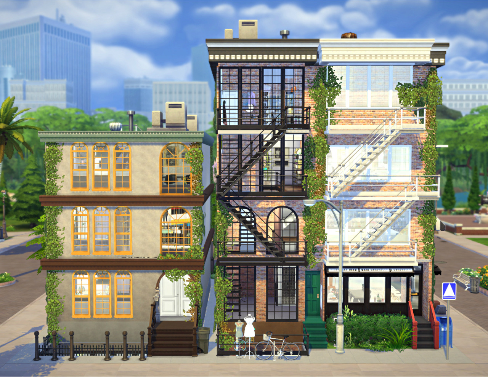

    <audio src="output/podcast_editado.MP3" controls title="Podcast editado"></audio>

# Projeto Podcast Gerado por I.A.s

 > ℹ️ **NOTE:** Este é o repositório desenvolvido durante um curso na [DIO](https://dio.me)

Projeto com o objetivo de gerar um podcast utilizando ferramentas de IA através de prompts mais trabalhado.

## 💻 Tecnologias utilizadas no projeto

- [ChatGPT](https://chat.openai.com/) 
- [MidJourney](https://www.midjourney.com/app/)
- [ElevenLabs](https://beta.elevenlabs.io/)
- [Capcut](https://www.capcut.com/pt-br/)

## ✨ Como foi feito ?

- Roteiro gerado via chatgpt
- Audio gerado pela elevenLabs
- Midjourney Para gerar capas
- Capcut para tratar aúdio e adicionar sons de fundo

## 📚 Materiais

- [Notion Template](https://helpful-jump-17b.notion.site/PAS-Podcast-AI-Studio-210489e15d7a4a73b743bb159e45d06f?pvs=4)
- [Editor de aúdio](https://www.capcut.com/editor?from_page=landing_page&__action_from=picture_V%C3%ADdeos%20profissionais%20em%20minutos,%20n%C3%A3o%20em%20horas.)

## 🛠️ Execução

Prompts dentro do link do `Notion` fornecido na parte de `Materiais` para criar o podcast de maneira automatizada.
